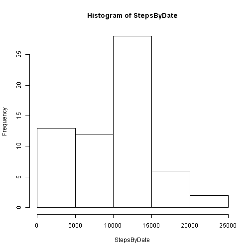
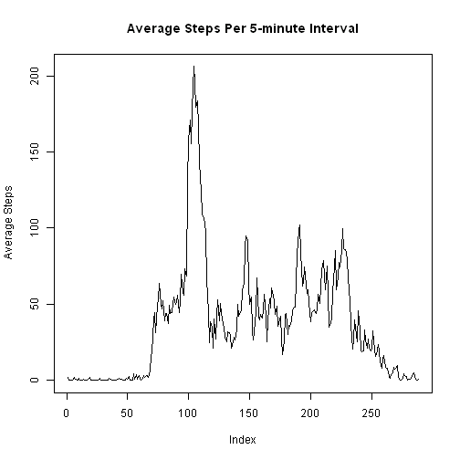

Reproducibe Research Progamming Assignment 1
========================================================

### Read raw data.

```r
A <- read.csv("activity.csv", as.is = T)
head(A)
```

```
##   steps       date interval
## 1    NA 2012-10-01        0
## 2    NA 2012-10-01        5
## 3    NA 2012-10-01       10
## 4    NA 2012-10-01       15
## 5    NA 2012-10-01       20
## 6    NA 2012-10-01       25
```

```r
tail(A)
```

```
##       steps       date interval
## 17563    NA 2012-11-30     2330
## 17564    NA 2012-11-30     2335
## 17565    NA 2012-11-30     2340
## 17566    NA 2012-11-30     2345
## 17567    NA 2012-11-30     2350
## 17568    NA 2012-11-30     2355
```

```r
fieldnames <- names(A)
print("field names...", quote = F)
```

```
## [1] field names...
```

```r
print(fieldnames)
```

```
## [1] "steps"    "date"     "interval"
```


### Seconds per day, days, expected number of samples, sample count check.

```r
spd <- 24 * 60/5
days = 31 + 30
sbSamples <- spd * days
ns <- nrow(A)
print(sprintf("got (%d) == expected (%d) samples: %s", ns, sbSamples, ns == 
    sbSamples), quote = F)
```

```
## [1] got (17568) == expected (17568) samples: TRUE
```


### Sorted?

```r
z <- A[order(A$date, A$interval), ]
print("data are sorted by date, interval...", quote = F)
```

```
## [1] data are sorted by date, interval...
```

```r
ns == sum(z$date == A$date)
```

```
## [1] TRUE
```

```r
ns == sum(z$interval == A$interval)
```

```
## [1] TRUE
```

```r
rm(z)
```


### Field types.

```r
class(A$steps)
```

```
## [1] "integer"
```

```r
class(A$date)
```

```
## [1] "character"
```

```r
class(A$interval)
```

```
## [1] "integer"
```


### NA, Zero, NonZero counts (by interval).

```r
nAna <- sum(is.na(A$steps))
nAz <- sum(A$steps == 0, na.rm = T)
nAnz <- sum(A$steps != 0, na.rm = T)
print(sprintf("A$steps NA: %d, zero: %d, nonzero: %d", nAna, nAz, nAnz), quote = F)
```

```
## [1] A$steps NA: 2304, zero: 11014, nonzero: 4250
```


### Save the raw steps value in another field.

```r
A$rawSteps <- A$steps
```


### Add a field indicating that steps is NA.

```r
A$naSteps <- is.na(A$steps)

## Add an empty field for imputed steps.
```

```r
A$impSteps <- NA
```


### Add a day-of-week field.

```r
A$DOW <- weekdays(strptime(A$date, format = "%Y-%m-%d"), abbreviate = T)
A$facDOW <- factor(A$DOW, levels = c("Mon", "Tue", "Wed", "Thu", "Fri", "Sat", 
    "Sun"), ordered = T)
```


### Add a weekday/weekend factor.

```r
A$wdwe <- factor(A$facDOW >= "Sat" & A$facDOW <= "Sun", labels = c("weekday", 
    "weekend"))
sum(A$wdwe == "weekday")
```

```
## [1] 12960
```

```r
sum(A$wdwe == "weekend")
```

```
## [1] 4608
```


### Split steps by date, interval

```r
splitStepsByDate <- split(A$steps, as.factor(A$date))
splitStepsByInterval <- split(A$steps, as.factor(A$interval))
length(splitStepsByDate)
```

```
## [1] 61
```

```r
length(splitStepsByInterval)
```

```
## [1] 288
```


### Aggregate by date, interval.

```r
StepsByDate <- sapply(splitStepsByDate, sum, na.rm = T)
meanStepsByDate <- sapply(splitStepsByDate, mean, na.rm = T)
medianStepsByDate <- sapply(splitStepsByDate, median, na.rm = T)
StepsByInterval <- sapply(splitStepsByInterval, sum, na.rm = T)
meanStepsByInterval <- sapply(splitStepsByInterval, mean, na.rm = T)
medianStepsByInterval <- sapply(splitStepsByInterval, median, na.rm = T)
```


### Histogram of steps per day.

```r
hist(StepsByDate)
```

 

```r

### Report mean, median by day
```

```r
print("Date, Mean steps, Median steps...", quote = F)
```

```
## [1] Date, Mean steps, Median steps...
```

```r
for (i in 1:length(StepsByDate)) {
    print(sprintf("%s  mean %4.1f  median %4.1f", names(StepsByDate[i]), meanStepsByDate[i], 
        medianStepsByDate[i]), quote = F)
}
```

```
## [1] 2012-10-01  mean  NaN  median   NA
## [1] 2012-10-02  mean  0.4  median  0.0
## [1] 2012-10-03  mean 39.4  median  0.0
## [1] 2012-10-04  mean 42.1  median  0.0
## [1] 2012-10-05  mean 46.2  median  0.0
## [1] 2012-10-06  mean 53.5  median  0.0
## [1] 2012-10-07  mean 38.2  median  0.0
## [1] 2012-10-08  mean  NaN  median   NA
## [1] 2012-10-09  mean 44.5  median  0.0
## [1] 2012-10-10  mean 34.4  median  0.0
## [1] 2012-10-11  mean 35.8  median  0.0
## [1] 2012-10-12  mean 60.4  median  0.0
## [1] 2012-10-13  mean 43.1  median  0.0
## [1] 2012-10-14  mean 52.4  median  0.0
## [1] 2012-10-15  mean 35.2  median  0.0
## [1] 2012-10-16  mean 52.4  median  0.0
## [1] 2012-10-17  mean 46.7  median  0.0
## [1] 2012-10-18  mean 34.9  median  0.0
## [1] 2012-10-19  mean 41.1  median  0.0
## [1] 2012-10-20  mean 36.1  median  0.0
## [1] 2012-10-21  mean 30.6  median  0.0
## [1] 2012-10-22  mean 46.7  median  0.0
## [1] 2012-10-23  mean 31.0  median  0.0
## [1] 2012-10-24  mean 29.0  median  0.0
## [1] 2012-10-25  mean  8.7  median  0.0
## [1] 2012-10-26  mean 23.5  median  0.0
## [1] 2012-10-27  mean 35.1  median  0.0
## [1] 2012-10-28  mean 39.8  median  0.0
## [1] 2012-10-29  mean 17.4  median  0.0
## [1] 2012-10-30  mean 34.1  median  0.0
## [1] 2012-10-31  mean 53.5  median  0.0
## [1] 2012-11-01  mean  NaN  median   NA
## [1] 2012-11-02  mean 36.8  median  0.0
## [1] 2012-11-03  mean 36.7  median  0.0
## [1] 2012-11-04  mean  NaN  median   NA
## [1] 2012-11-05  mean 36.2  median  0.0
## [1] 2012-11-06  mean 28.9  median  0.0
## [1] 2012-11-07  mean 44.7  median  0.0
## [1] 2012-11-08  mean 11.2  median  0.0
## [1] 2012-11-09  mean  NaN  median   NA
## [1] 2012-11-10  mean  NaN  median   NA
## [1] 2012-11-11  mean 43.8  median  0.0
## [1] 2012-11-12  mean 37.4  median  0.0
## [1] 2012-11-13  mean 25.5  median  0.0
## [1] 2012-11-14  mean  NaN  median   NA
## [1] 2012-11-15  mean  0.1  median  0.0
## [1] 2012-11-16  mean 18.9  median  0.0
## [1] 2012-11-17  mean 49.8  median  0.0
## [1] 2012-11-18  mean 52.5  median  0.0
## [1] 2012-11-19  mean 30.7  median  0.0
## [1] 2012-11-20  mean 15.5  median  0.0
## [1] 2012-11-21  mean 44.4  median  0.0
## [1] 2012-11-22  mean 70.9  median  0.0
## [1] 2012-11-23  mean 73.6  median  0.0
## [1] 2012-11-24  mean 50.3  median  0.0
## [1] 2012-11-25  mean 41.1  median  0.0
## [1] 2012-11-26  mean 38.8  median  0.0
## [1] 2012-11-27  mean 47.4  median  0.0
## [1] 2012-11-28  mean 35.4  median  0.0
## [1] 2012-11-29  mean 24.5  median  0.0
## [1] 2012-11-30  mean  NaN  median   NA
```


### Plot steps by interval.

```r
plot(meanStepsByInterval, type = "l", ylab = "Average Steps", main = "Average Steps Per 5-minute Interval")
```

 


### Which interval has max steps?

```r
maxI = 1
maxMean = meanStepsByInterval[[1]]
for (i in 2:length(meanStepsByInterval)) {
    if (meanStepsByInterval[[i]] > maxMean) {
        maxI <- i
        maxMean <- meanStepsByInterval[[i]]
    }
}
print(sprintf("Interval %d has maximum average steps (%.1f)", maxI, maxMean), 
    quote = F)
```

```
## [1] Interval 104 has maximum average steps (206.2)
```


### Impute missing steps from 5-minute medians.

```r
nI = 0
nZimpute <- 0
nNZimpute <- 0
for (i in 1:ns) {
    if (A$naSteps[i]) {
        nI <- nI + 1
        for (j in 1:length(medianStepsByInterval)) {
            k <- as.integer(names(medianStepsByInterval[j]))
            m <- medianStepsByInterval[j]
            if (A$interval[i] == k) {
                if (m == 0) {
                  nZimpute <- nZimpute + 1
                } else {
                  nNZimpute <- nNZimpute + 1
                }
                A$impSteps <- m
                break
            }
        }
        A$impSteps[i] <- A$impSteps[i]
    } else {
        A$impSteps[i] <- A$steps[i]
    }
}
nI
```

```
## [1] 2304
```

```r
nZimpute
```

```
## [1] 1880
```

```r
nNZimpute
```

```
## [1] 424
```

```r
nI == sum(is.na(A$steps))
```

```
## [1] TRUE
```


### Copy imputed steps into steps.

```r
A$steps <- A$impSteps
ns == sum(is.na(A$steps))
```

```
## [1] FALSE
```


### Redo aggregation by date, interval.

```r
StepsByDate <- sapply(splitStepsByDate, sum, na.rm = T)
meanStepsByDate <- sapply(splitStepsByDate, mean, na.rm = T)
medianStepsByDate <- sapply(splitStepsByDate, median, na.rm = T)
StepsByInterval <- sapply(splitStepsByInterval, sum, na.rm = T)
meanStepsByInterval <- sapply(splitStepsByInterval, mean, na.rm = T)
medianStepsByInterval <- sapply(splitStepsByInterval, median, na.rm = T)
```


### Redo histogram of steps per day.

```r
hist(StepsByDate)
```

 


### Redo report mean, median by day

```r
print("Date, Mean steps, Median steps...", quote = F)
```

```
## [1] Date, Mean steps, Median steps...
```

```r
for (i in 1:length(StepsByDate)) {
    print(sprintf("%s  mean %4.1f  median %4.1f", names(StepsByDate[i]), meanStepsByDate[i], 
        medianStepsByDate[i]), quote = F)
}
```

```
## [1] 2012-10-01  mean  NaN  median   NA
## [1] 2012-10-02  mean  0.4  median  0.0
## [1] 2012-10-03  mean 39.4  median  0.0
## [1] 2012-10-04  mean 42.1  median  0.0
## [1] 2012-10-05  mean 46.2  median  0.0
## [1] 2012-10-06  mean 53.5  median  0.0
## [1] 2012-10-07  mean 38.2  median  0.0
## [1] 2012-10-08  mean  NaN  median   NA
## [1] 2012-10-09  mean 44.5  median  0.0
## [1] 2012-10-10  mean 34.4  median  0.0
## [1] 2012-10-11  mean 35.8  median  0.0
## [1] 2012-10-12  mean 60.4  median  0.0
## [1] 2012-10-13  mean 43.1  median  0.0
## [1] 2012-10-14  mean 52.4  median  0.0
## [1] 2012-10-15  mean 35.2  median  0.0
## [1] 2012-10-16  mean 52.4  median  0.0
## [1] 2012-10-17  mean 46.7  median  0.0
## [1] 2012-10-18  mean 34.9  median  0.0
## [1] 2012-10-19  mean 41.1  median  0.0
## [1] 2012-10-20  mean 36.1  median  0.0
## [1] 2012-10-21  mean 30.6  median  0.0
## [1] 2012-10-22  mean 46.7  median  0.0
## [1] 2012-10-23  mean 31.0  median  0.0
## [1] 2012-10-24  mean 29.0  median  0.0
## [1] 2012-10-25  mean  8.7  median  0.0
## [1] 2012-10-26  mean 23.5  median  0.0
## [1] 2012-10-27  mean 35.1  median  0.0
## [1] 2012-10-28  mean 39.8  median  0.0
## [1] 2012-10-29  mean 17.4  median  0.0
## [1] 2012-10-30  mean 34.1  median  0.0
## [1] 2012-10-31  mean 53.5  median  0.0
## [1] 2012-11-01  mean  NaN  median   NA
## [1] 2012-11-02  mean 36.8  median  0.0
## [1] 2012-11-03  mean 36.7  median  0.0
## [1] 2012-11-04  mean  NaN  median   NA
## [1] 2012-11-05  mean 36.2  median  0.0
## [1] 2012-11-06  mean 28.9  median  0.0
## [1] 2012-11-07  mean 44.7  median  0.0
## [1] 2012-11-08  mean 11.2  median  0.0
## [1] 2012-11-09  mean  NaN  median   NA
## [1] 2012-11-10  mean  NaN  median   NA
## [1] 2012-11-11  mean 43.8  median  0.0
## [1] 2012-11-12  mean 37.4  median  0.0
## [1] 2012-11-13  mean 25.5  median  0.0
## [1] 2012-11-14  mean  NaN  median   NA
## [1] 2012-11-15  mean  0.1  median  0.0
## [1] 2012-11-16  mean 18.9  median  0.0
## [1] 2012-11-17  mean 49.8  median  0.0
## [1] 2012-11-18  mean 52.5  median  0.0
## [1] 2012-11-19  mean 30.7  median  0.0
## [1] 2012-11-20  mean 15.5  median  0.0
## [1] 2012-11-21  mean 44.4  median  0.0
## [1] 2012-11-22  mean 70.9  median  0.0
## [1] 2012-11-23  mean 73.6  median  0.0
## [1] 2012-11-24  mean 50.3  median  0.0
## [1] 2012-11-25  mean 41.1  median  0.0
## [1] 2012-11-26  mean 38.8  median  0.0
## [1] 2012-11-27  mean 47.4  median  0.0
## [1] 2012-11-28  mean 35.4  median  0.0
## [1] 2012-11-29  mean 24.5  median  0.0
## [1] 2012-11-30  mean  NaN  median   NA
```


## End.

